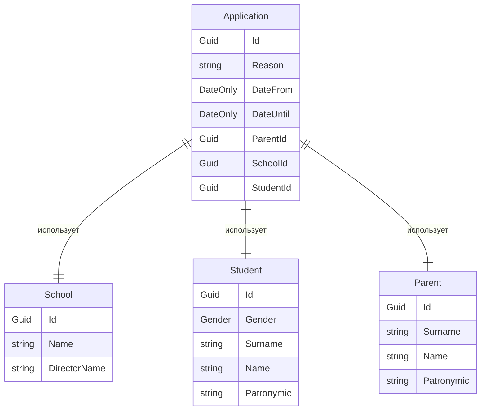

# Описание предметной области
Автоматизация заполнения заявления на отсутствие в учебном заведении
# Схема моделей

# Пример реального бизнес сценария


# Реализация API
## CRUD заявлений
|TYPE|URL|DESCRIPTION|REQUEST|RESPONSE|CODES|
|-|-|-|-|-|-|
| GET | Api/Application/{id}/Export | Экспортирует заявление | FromRoute: id | File .xlsx | 200 OK<br/>404 NotFound |
| GET | Api/Application/| Получает список всех заявлений | | `ApplicationApiModel[]` | 200 OK |
| GET | Api/Application/{id}| Получает заявление по идентификатору | FromRoute: id | `ApplicationApiModel` | 200 OK<br/>404 NotFound |
| POST | Api/Application/| Добавляет новое заявление | FromBody: `ApplicationRequestApiModel` | `ApplicationApiModel` | 200 OK<br/>422 UnprocessableEntity |
| PUT | Api/Application/{id}| Редактирует заявление по идентификатору | FromRoute: id <br/>FromBody: `ApplicationRequestApiModel` | `ApplicationApiModel` | 200 OK<br/>404 NotFound<br/>422 UnprocessableEntity |
| DELETE | Api/Application/{id}| Удаляет заявление по идентификатору | FromRoute: id | | 200 OK<br/>404 NotFound |

```javascript
// ApplicationApiModel
  {
    "id": "3fa85f64-5717-4562-b3fc-2c963f66afa6",
    "student": {
      "id": "3fa85f64-5717-4562-b3fc-2c963f66afa6",
      "gender": 0,
      "surname": "string",
      "name": "string",
      "patronymic": "string",
      "grade": "string"
    },
    "parent": {
      "id": "3fa85f64-5717-4562-b3fc-2c963f66afa6",
      "surname": "string",
      "name": "string",
      "patronymic": "string"
    },
    "school": {
      "id": "3fa85f64-5717-4562-b3fc-2c963f66afa6",
      "name": "string",
      "directorName": "string"
    },
    "reason": "string",
    "dateFrom": "2025-09-15",
    "dateUntil": "2025-09-15"
  }

// ApplicationCreateRequestApiModel
  {
    "studentId": "5f35bc4a-21d3-4eaa-98bc-6f07f7ecc46b",
    "parentId": "b0b99f1d-691a-4b62-bd8d-5ae8cc526bcd",
    "schoolId": "64fe89b3-7b85-4bce-bf77-2197291f7ffa",
    "reason": "по семейным обстоятельствам",
    "dateFrom": "2025-08-23",
    "dateUntil": "2025-08-25"
  }
```

## CRUD родителей
|TYPE|URL|DESCRIPTION|REQUEST|RESPONSE|CODES|
|-|-|-|-|-|-|
| GET | Api/Parent/|Получает список всех родителей | | `ParentApiModel[]` | 200 OK |
| GET | Api/Parent/{id}| Получает родителя по идентификатору | FromRoute: id | `ParentApiModel` | 200 OK<br/>404 NotFound |
| POST | Api/Parent/|Добавляет нового родителя | FromBody: `ParentCreateRequestApiModel` | `ParentApiModel` | 200 OK<br/>422 UnprocessableEntity |
| PUT | Api/Parent/{id}|Редактирует родителя по идентификатору | FromRoute: id <br/>FromBody: `ParentCreateRequestApiModel` | `ParentApiModel` | 200 OK<br/>404 NotFound<br/>422 UnprocessableEntity |
| DELETE | Api/Parent/{id}|Удаляет родителя по идентификатору | FromRoute: id | | 200 OK<br/>404 NotFound<br/>422 UnprocessableEntity |

```javascript
// ParentApiModel
  {
    "id": "b0b99f1d-691a-4b62-bd8d-5ae8cc526bcd",
    "surname": "Иванова",
    "name": "Ирина",
    "patronymic": "Игоревна"
  }

// ParentCreateRequestApiModel
  {
    "surname": "Иванова",
    "name": "Ирина",
    "patronymic": "Игоревна"
  }
```

## CRUD школ
|TYPE|URL|DESCRIPTION|REQUEST|RESPONSE|CODES|
|-|-|-|-|-|-|
| GET | Api/School/|Получает список всех школ | | `SchoolApiModel[]` | 200 OK |
| GET | Api/School/{id}| Получает школу по идентификатору | FromRoute: id | `SchoolApiModel` | 200 OK<br/>404 NotFound |
| POST | Api/School/|Добавляет новую школу | FromBody: `SchoolCreateRequestApiModel` | `SchoolApiModel` | 200 OK<br/>422 UnprocessableEntity |
| PUT | Api/School/{id}|Редактирует школу по идентификатору | FromRoute: id <br/>FromBody: `SchoolCreateRequestApiModel` | `SchoolApiModel` | 200 OK<br/>404 NotFound<br/>422 UnprocessableEntity |
| DELETE | Api/School/{id}|Удаляет школу по идентификатору | FromRoute: id | | 200 OK<br/>404 NotFound<br/>422 UnprocessableEntity |

```javascript
// SchoolApiModel
  {
    "id": "64fe89b3-7b85-4bce-bf77-2197291f7ffa",
    "name": "Школа №25",
    "directorName": "Петрова Наталья Дмитриевна"
  }

// SchoolCreateRequestApiModel
  {
    "name": "Школа №25",
    "directorName": "Петрова Наталья Дмитриевна"
  }
```

## CRUD учеников
|TYPE|URL|DESCRIPTION|REQUEST|RESPONSE|CODES|
|-|-|-|-|-|-|
| GET | Api/Student/|Получает список всех учеников | | `StudentApiModel[]` | 200 OK |
| GET | Api/Student/{id}| Получает ученика по идентификатору | FromRoute: id | `StudentApiModel` | 200 OK<br/>404 NotFound |
| POST | Api/Student/|Добавляет нового ученика | FromBody: `StudentCreateRequestApiModel` | `StudentApiModel` | 200 OK<br/>422 UnprocessableEntity |
| PUT | Api/Student/{id}|Редактирует ученика по идентификатору | FromRoute: id <br/>FromBody: `StudentCreateRequestApiModel` | `StudentApiModel` | 200 OK<br/>404 NotFound<br/>422 UnprocessableEntity |
| DELETE | Api/Student/{id}|Удаляет ученика по идентификатору | FromRoute: id | | 200 OK<br/>404 NotFound<br/>422 UnprocessableEntity |

```javascript
// StudentApiModel
  {
    "id": "5f35bc4a-21d3-4eaa-98bc-6f07f7ecc46b",
    "gender": 0,
    "surname": "Кузьмин",
    "name": "Василий",
    "patronymic": "Андреевич",
    "grade": "8А"
  }

// StudentCreateRequestApiModel
  {
    "gender": 0,
    "surname": "Кузьмин",
    "name": "Василий",
    "patronymic": "Андреевич",
    "grade": "8А"
  }
```
