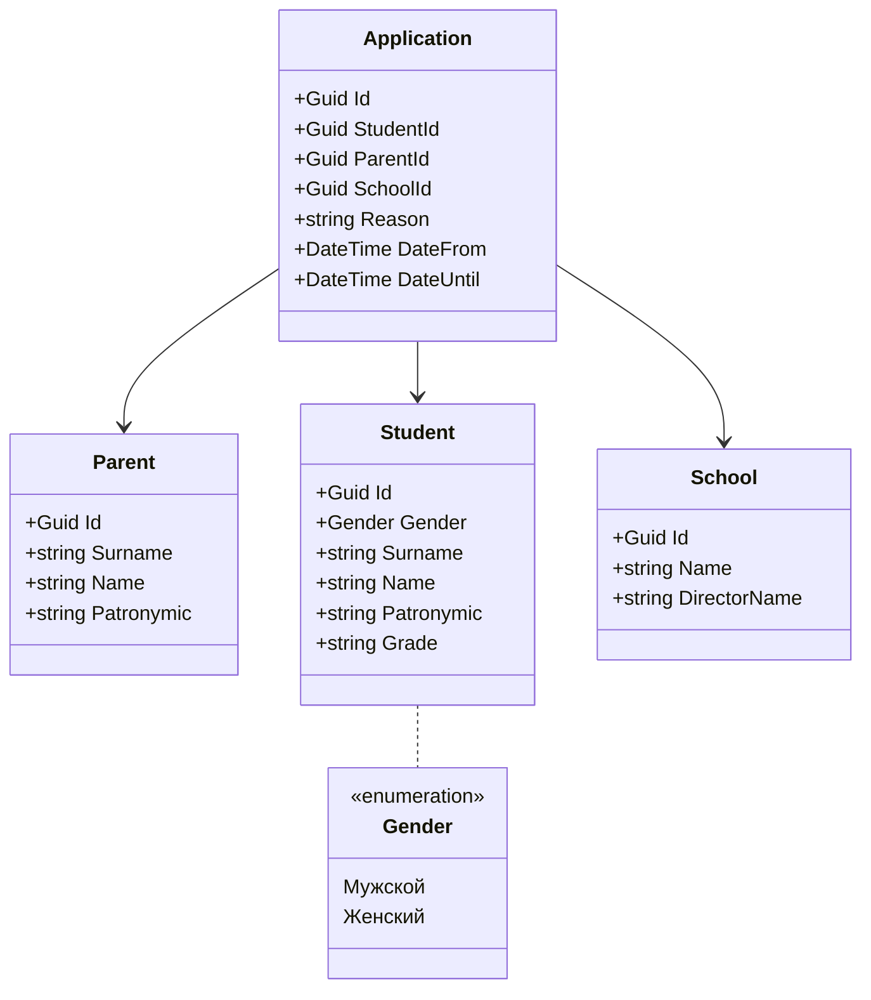

# Описание предметной области
Автоматизация заполнения заявления на отсутствие в учебном заведении
# Автор
Каменский Илья ИП-23-3
# Схема моделей

# Пример реального бизнес сценария


# Реализация API
## CRUD заявлений
|TYPE|URL|DESCRIPTION|REQUEST|RESPONSE|CODES|
|-|-|-|-|-|-|
| GET | api/Application/{id}/export | Экспортирует заявление | FromRoute: id | File .xlsx | 200 OK<br/>404 NotFound |
| GET | api/Application/| Получает список всех заявлений | | `IReadOnlyCollection<ApplicationApiModel>` | 200 OK |
| POST | api/Application/| Добавляет новое заявление | FromBody: `ApplicationRequestApiModel` | `ApplicationApiModel` | 200 OK<br/>422 UnprocessableEntity<br/>400 BadRequest |
| PUT | api/Application/{id}| Редактирует заявление по идентификатору | FromRoute: id <br/>FromBody: `ApplicationRequestApiModel` | `ApplicationApiModel` | 200 OK<br/>404 NotFound<br/>422 UnprocessableEntity<br/>400 BadRequest |
| DELETE | api/Application/{id}| Удаляет заявление по идентификатору | FromRoute: id | | 200 OK<br/>404 NotFound<br/>422 UnprocessableEntity<br/>400 BadRequest |

```javascript
// ApplicationApiModel
  {
    "id": "59666fc5-8a98-4a37-8423-bb792cec3a78",
    "studentId": "5f35bc4a-21d3-4eaa-98bc-6f07f7ecc46b",
    "parentId": "b0b99f1d-691a-4b62-bd8d-5ae8cc526bcd",
    "schoolId": "64fe89b3-7b85-4bce-bf77-2197291f7ffa",
    "reason": "по семейным обстоятельствам",
    "dateFrom": "2025-08-23T10:43:43.982",
    "dateUntil": "2025-08-25T10:43:43.982"
  }

// ApplicationRequestApiModel
  {
    "studentId": "5f35bc4a-21d3-4eaa-98bc-6f07f7ecc46b",
    "parentId": "b0b99f1d-691a-4b62-bd8d-5ae8cc526bcd",
    "schoolId": "64fe89b3-7b85-4bce-bf77-2197291f7ffa",
    "reason": "по семейным обстоятельствам",
    "dateFrom": "2025-08-23T10:43:43.982",
    "dateUntil": "2025-08-25T10:43:43.982"
  }
```

## CRUD родителей
|TYPE|URL|DESCRIPTION|REQUEST|RESPONSE|CODES|
|-|-|-|-|-|-|
| GET | api/Parent/|Получает список всех родителей | | `IReadOnlyCollection<ParentApiModel>` | 200 OK |
| POST | api/Parent/|Добавляет нового родителя | FromBody: `ParentRequestApiModel` | `ParentApiModel` | 200 OK<br/>422 UnprocessableEntity<br/>400 BadRequest |
| PUT | api/Parent/{id}|Редактирует родителя по идентификатору | FromRoute: id <br/>FromBody: `ParentRequestApiModel` | `ParentApiModel` | 200 OK<br/>404 NotFound<br/>422 UnprocessableEntity<br/>400 BadRequest |
| DELETE | api/Parent/{id}|Удаляет родителя по идентификатору | FromRoute: id | | 200 OK<br/>404 NotFound<br/>422 UnprocessableEntity<br/>400 BadRequest |

```javascript
// ParentApiModel
  {
    "id": "b0b99f1d-691a-4b62-bd8d-5ae8cc526bcd",
    "surname": "Иванова",
    "name": "Ирина",
    "patronymic": "Игоревна"
  }

// ParentRequestApiModel
  {
    "surname": "Иванова",
    "name": "Ирина",
    "patronymic": "Игоревна"
  }
```

## CRUD школ
|TYPE|URL|DESCRIPTION|REQUEST|RESPONSE|CODES|
|-|-|-|-|-|-|
| GET | api/School/|Получает список всех школ | | `IReadOnlyCollection<SchoolApiModel>` | 200 OK |
| POST | api/School/|Добавляет новую школу | FromBody: `SchoolRequestApiModel` | `SchoolApiModel` | 200 OK<br/>422 UnprocessableEntity<br/>400 BadRequest |
| PUT | api/School/{id}|Редактирует школу по идентификатору | FromRoute: id <br/>FromBody: `SchoolRequestApiModel` | `SchoolApiModel` | 200 OK<br/>404 NotFound<br/>422 UnprocessableEntity<br/>400 BadRequest |
| DELETE | api/School/{id}|Удаляет школу по идентификатору | FromRoute: id | | 200 OK<br/>404 NotFound<br/>422 UnprocessableEntity<br/>400 BadRequest |

```javascript
// SchoolApiModel
  {
    "id": "64fe89b3-7b85-4bce-bf77-2197291f7ffa",
    "name": "Школа №25",
    "directorName": "Петрова Наталья Дмитриевна"
  }

// SchoolRequestApiModel
  {
    "name": "Школа №25",
    "directorName": "Петрова Наталья Дмитриевна"
  }
```

## CRUD учеников
|TYPE|URL|DESCRIPTION|REQUEST|RESPONSE|CODES|
|-|-|-|-|-|-|
| GET | api/Student/|Получает список всех учеников | | `IReadOnlyCollection<StudentApiModel>` | 200 OK |
| POST | api/Student/|Добавляет нового ученика | FromBody: `StudentRequestApiModel` | `StudentApiModel` | 200 OK<br/>422 UnprocessableEntity<br/>400 BadRequest |
| PUT | api/Student/{id}|Редактирует ученика по идентификатору | FromRoute: id <br/>FromBody: `StudentRequestApiModel` | `StudentApiModel` | 200 OK<br/>404 NotFound<br/>422 UnprocessableEntity<br/>400 BadRequest |
| DELETE | api/Student/{id}|Удаляет ученика по идентификатору | FromRoute: id | | 200 OK<br/>404 NotFound<br/>422 UnprocessableEntity<br/>400 BadRequest |

```javascript
// StudentApiModel
  {
    "id": "5f35bc4a-21d3-4eaa-98bc-6f07f7ecc46b",
    "gender": 0,
    "surname": "Кузьмин",
    "name": "Василий",
    "patronymic": "Андреевич",
    "grade": "8А"
  }

// StudentRequestApiModel
  {
    "gender": 0,
    "surname": "Кузьмин",
    "name": "Василий",
    "patronymic": "Андреевич",
    "grade": "8А"
  }
```
